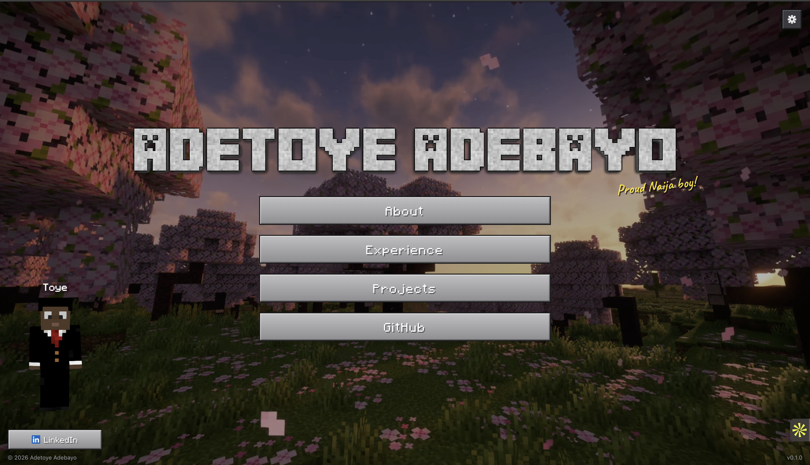

# Adetoye Adebayo - Portfolio

A Minecraft-themed personal portfolio site. Blocky UI, a 3D character that follows your cursor, a looping background video, and toggleable sound.

**Live at [adetoyeadebayo.com](https://adetoyeadebayo.com)**

## Built with

- Vite
- React + TypeScript
- Tailwind CSS
- [skinview3d](https://github.com/bs-community/skinview3d) for the 3D character viewer

## Pages

- **About** — who I am, skills, a few photos
- **Experience** — where I've worked and studied (hover or tap a card for details)
- **Projects** — things I've built
- **GitHub** — my profile

## Deploy

Pushing to `main` builds the site and deploys it to GitHub Pages automatically.
